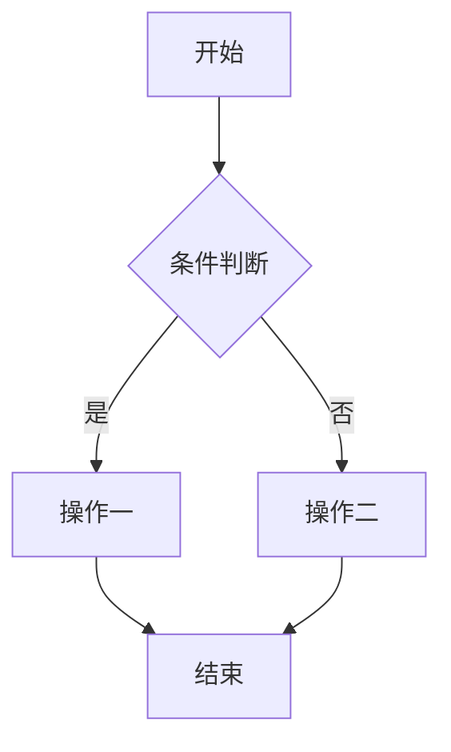
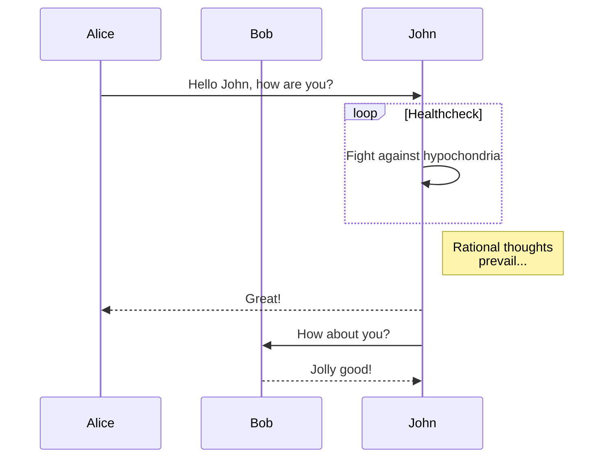
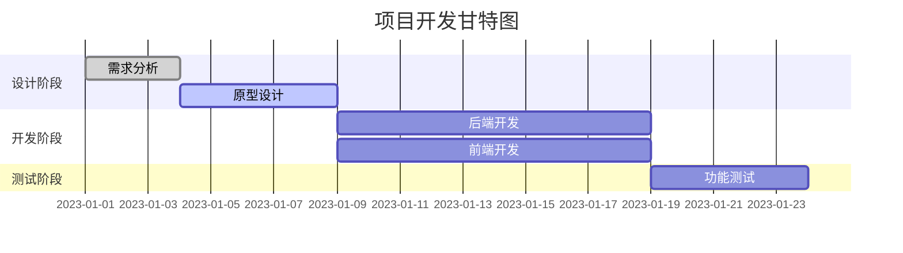
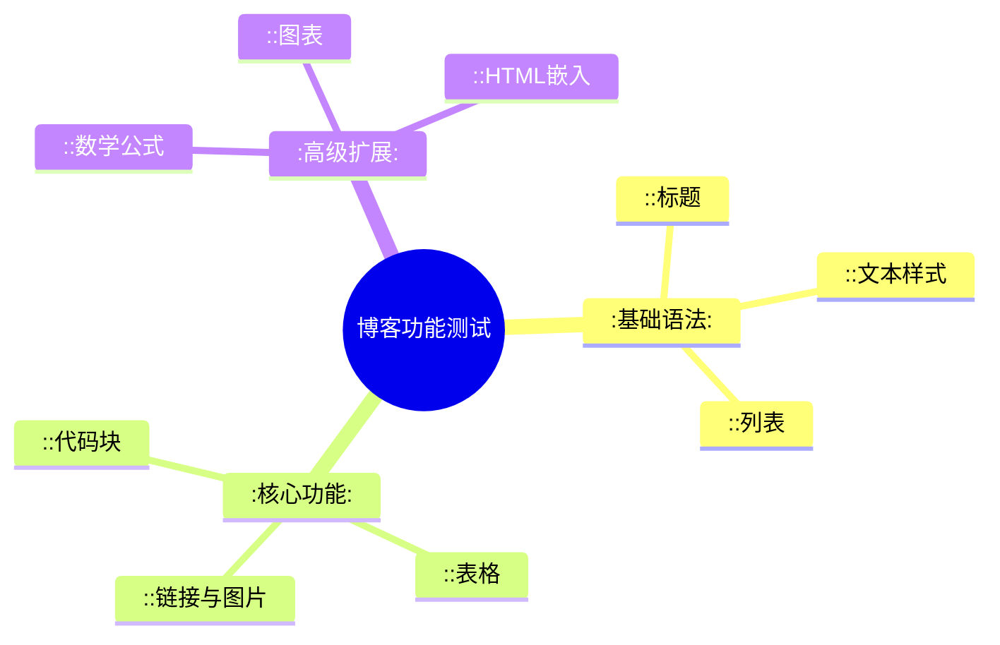

## 1. 基础格式化

### 1.1 标题 (Headings)

# H1: 一级标题
## H2: 二级标题
### H3: 三级标题
#### H4: 四级标题
##### H5: 五级标题
###### H6: 六级标题

### 1.2 段落与换行 (Paragraphs & Line Breaks)

这是一个普通的段落。它包含了三行文本，但在渲染时应该合并为一段。
这是一个普通的段落。它包含了三行文本，但在渲染时应该合并为一段。
这是一个普通的段落。它包含了三行文本，但在渲染时应该合并为一段。

如果需要强制换行，可以在行尾添加两个或更多的空格。  
就像这样，这里发生了强制换行。

或者，也可以使用 HTML 的 `<br>` 标签。<br>这也是一个强制换行。

### 1.3 文本样式 (Text Styles)

- **粗体**: `**这是粗体文本**` -> **这是粗体文本**
- **斜体**: `*这是斜体文本*` -> *这是斜体文本*
- **粗斜体**: `***这是粗斜体文本***` -> ***这是粗斜体文本***
- ~~删除线~~: `~~这是删除线文本~~` -> ~~这是删除线文本~~
- `行内代码`: \` \`这是一个行内代码块\` \` -> `这是一个行内代码块`
- <u>下划线</u>: `<u>下划线</u>` -> <u>下划线</u> (通常通过 HTML 实现)
- 高亮: `==这是高亮文本==` -> ==这是高亮文本== (扩展语法)
- 上标: `X^2^` -> X^2^ (扩展语法)
- 下标: `H~2~O` -> H~2~O (扩展语法)

---

## 2. 列表 (Lists)

### 2.1 无序列表 (Unordered Lists)

* 项目一 (使用 `*`)
- 项目二 (使用 `-`)
  - 嵌套项目 2.1
    - 嵌套项目 2.1.1
+ 项目三 (使用 `+`)

### 2.2 有序列表 (Ordered Lists)

1. 第一项
2. 第二项
3. 第三项
   1. 嵌套第一项
   2. 嵌套第二项

### 2.3 任务列表 (Task Lists)

- [x] 已完成的任务
- [ ] 未完成的任务
- [ ] 待办事项
  - [x] 子任务一（已完成）
  - [ ] 子任务二（未完成）

---

## 3. 引用、链接和图片

### 3.1 块引用 (Blockquotes)

> 这是一个块引用。
>
> > 这是一个嵌套的块引用。
> >
> > -- 《出处》

### 3.2 链接 (Links)

- **行内链接**: [我的博客](https://example.com "这是一个提示标题")
- **引用链接**: [GitHub][1] 是一个代码托管平台。
- **自动链接**: <https://www.google.com>

[1]: https://github.com/ "GitHub 官网"

### 3.3 图片 (Images)


---

## 4. 代码块 (Code Blocks)

### 4.1 普通代码块（无语法高亮）

```
这是一个普通的代码块，
通常用于显示不希望被格式化的纯文本。
  保留了      空格和缩进。
```

### 4.2 语法高亮代码块

测试不同语言的语法高亮。

**JavaScript:**
```javascript
function greet(name) {
  // 这是一个单行注释
  console.log(`Hello, ${name}!`);
}

greet('World');
```

**Python:**
```python
# 这是一个 Python 示例
def fibonacci(n):
    a, b = 0, 1
    while a < n:
        print(a, end=' ')
        a, b = b, a+b
    print()

fibonacci(100)
```

**CSS:**
```css
/* CSS 代码高亮测试 */
body {
  font-family: 'Arial', sans-serif;
  line-height: 1.6;
  background-color: #f4f4f4;
}
```

---

## 5. 表格 (Tables)

| 左对齐 | 居中对齐 | 右对齐 |
| :--- | :---: | ---: |
| 内容 A1 | 内容 B1 | 内容 C1 |
| 内容 A2 | 内容 B2 | 内容 C2 |
| `code` | **bold** | *italic* |

---

## 6. 水平分割线 (Horizontal Rules)

可以通过三种方式创建水平分割线：

---

***

___

---

## 7. 高级与扩展特性

这部分特性可能需要特定的插件或库（如 KaTeX, Mermaid.js 等）支持。

### 7.1 脚注 (Footnotes)

这是一个包含脚注的句子[^1]。这是另一个脚注[^another]。

[^1]: 这是第一个脚注的详细内容。
[^another]: 这是另一个脚注的详细内容，可以包含[链接](https://example.com)。

### 7.2 数学公式 (Math Formulas - LaTeX)

**行内公式**: 质能方程 $E=mc^2$ 是物理学中最著名的公式之一。

**块级公式**:
$$
\int_a^b f(x)dx = F(b) - F(a)
$$

### 7.3 HTML 原生支持

你可以在 Markdown 中嵌入原生 HTML 标签。

<details>
  <summary>点击展开查看详情</summary>
  <p>这里是隐藏的详细内容。可以包含其他 Markdown 格式，例如 **粗体** 和 `代码`。</p>
</details>

<div style="padding: 15px; border: 1px solid #ccc; border-radius: 5px; background-color: #f9f9f9;">
  这是一个使用原生 HTML 和 CSS 创建的带样式的 DIV 容器。
</div>

### 7.4 警告/提示框 (Admonitions)

> [!NOTE]
> **提示**: 这是一个提示框，用于引起用户的注意。

> [!TIP]
> **技巧**: 这是一个技巧框，提供有用的建议。

> [!WARNING]
> **警告**: 这是一个警告框，需要用户特别注意。

> [!DANGER]
> **危险**: 这是一个危险框，表示操作可能带来严重后果。

### 7.5 图表与思维导图 (Diagrams - Mermaid)

**如果您的博客支持 Mermaid.js，下面的代码块应该被渲染成图表。**

#### 7.5.1 流程图 (Flowchart)



#### 7.5.2 序列图 (Sequence Diagram)



#### 7.5.3 甘特图 (Gantt Chart)



#### 7.5.4 思维导图 (Mind Map)



---

## 8. 总结

如果以上所有内容都能正确、美观地显示，那么恭喜你，你的博客 Markdown 渲染引擎非常强大！

